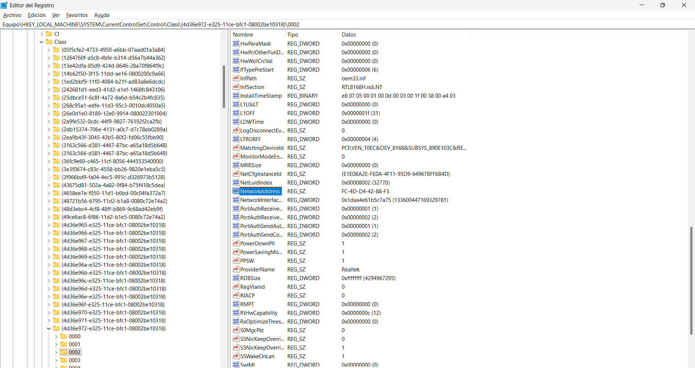
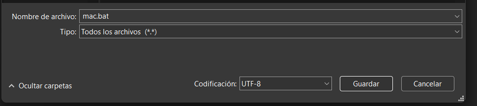

# Cambiar Mac En Windows

## Descripción
Este proyecto permite cambiar la dirección MAC en Windows mediante un script .bat que presenta un menú interactivo para facilitar el proceso.

## Características

- **Menu**: Al ejecutar el archivo .bat, se despliega un menú con varias opciones.
- **Direcciones MAC Predefinidas**: El menú incluye opciones con direcciones MAC predefinidas.predefinidas.
- **Ingreso Manual**:  También se puede ingresar manualmente una dirección MAC siguiendo el formato requerido.

## Codigo

    @echo off
    setlocal EnableDelayedExpansion

    :: Muestra las opciones de dirección MAC disponibles
    echo Selecciona una dirección MAC para cambiar:
    echo 1: Mac Oficina
    echo 2: Mac Aula
    echo 3: Mac Casa
    echo 4: Original
    echo 5: Mac manual
    echo.

    :: Solicita la opción al usuario
    set /P "mac=Introduce el número de la opción: "

    :: Asigna la dirección MAC seleccionada
    if "%mac%"=="1" (
        set "new_mac=C4-55-B1-E7-AA-8C"
    ) else if "%mac%"=="2" (
        set "new_mac=09-24-11-0F-C9-9D"
    ) else if "%mac%"=="3" (
        set "new_mac=FC-99-D4-42-88-69"
    ) else if "%mac%"=="4" (
        set "new_mac=KB-0F-I9-5B-C9-13"
    ) else if "%mac%"=="5" (
    set /P "new_mac=Introduce la MAC con formato xx-xx-xx-xx-xx-xx: "
    ) else (
        echo Opción no válida.
        goto :eof
    )

    :: Cambia la dirección MAC en la configuración avanzada del adaptador de red
    reg add "HKLM\SYSTEM\CurrentControlSet\Control\Class\{4D36E972-E325-11CE-BFC1-08002BE10318}\0002" /v NetworkAddress /t REG_SZ /d %new_mac% /f

    :: Reinicia el adaptador de red para que el cambio surta efecto
    netsh interface set interface "Ethernet" admin=disable
    netsh interface set interface "Ethernet" admin=enable

    endlocal

## Apartados del Codigo

### Mostrar las Opciones Disponibles

    :: Muestra las opciones de dirección MAC disponibles
        echo Selecciona una dirección MAC para cambiar:
        echo 1: Mac Oficina
        echo 2: Mac Aula
        echo 3: Mac Casa
        echo 4: Original
        echo 5: Mac manual
        echo.

Este fragmento presenta un menú con varias opciones predefinidas, junto con la opción de ingresar una dirección MAC de forma manual.

### Solicitar la Opción al Usuario

    set /P "mac=Introduce el número de la opción: "

Este comando solicita al usuario que seleccione una opción, almacenando la entrada en la variable mac.

### Asignar la Dirección MAC Seleccionada

    if "%mac%"=="1" (
        set "new_mac=C4-55-B1-E7-AA-8C"
    ) else if "%mac%"=="2" (
        set "new_mac=09-24-11-0F-C9-9D"
    ) else if "%mac%"=="3" (
        set "new_mac=FC-99-D4-42-88-69"
    ) else if "%mac%"=="4" (
        set "new_mac=KB-0F-I9-5B-C9-13"
    ) else if "%mac%"=="5" (
        set /P "new_mac=Introduce la MAC con formato xx-xx-xx-xx-xx-xx: "
    ) else (
        echo Opción no válida.
        goto :eof
    )

- Asigna una dirección MAC basada en la opción seleccionada.
- Si se selecciona la opción 4, se restaura la dirección original.
- En la opción 5, permite ingresar una dirección MAC personalizada.
- En caso de entrada inválida, el script muestra un mensaje de error y se detiene.

### Cambiar la Dirección MAC en el Registro

    reg add "HKLM\SYSTEM\CurrentControlSet\Control\Class\{4D36E972-E325-11CE-BFC1-08002BE10318}\0002" /v NetworkAddress /t REG_SZ /d %new_mac% /f

Este comando modifica el valor NetworkAddress en el registro de Windows.
- **Ruta:** Especifica la clave del adaptador de red.
- **/v NetworkAddress:** Define el valor a modificar.
- **/t REG_SZ:** Especifica que es una cadena de texto.
- **/d %new_mac%:** Asigna la nueva MAC seleccionada.
- **/f:** Fuerza el cambio sin pedir confirmación.

### Reiniciar el Adaptador de Red

    netsh interface set interface "Ethernet" admin=disable
    netsh interface set interface "Ethernet" admin=enable

Este comando reinicia el adaptador de red para aplicar los cambios.

## Obtecion de la ruta de la Registro de la Dirección MAC 
### Abre el Editor del Registro:

- Presiona Windows + R.
- Escribe regedit y presiona Enter.

### Navegamos a la siguiente ruta:

    HKEY_LOCAL_MACHINE\SYSTEM\CurrentControlSet\Control\Class

A partir de esta parte la ruta del registro puede cambiar ligeramente dependiendo de tu sistema y la configuración del adaptador de red. En este caso, navegamos hasta la ruta:

    HKEY_LOCAL_MACHINE\SYSTEM\CurrentControlSet\Control\Class\{4D36E972-E325-11CE-BFC1-08002BE10318}

### Explorar las Subclaves (0000, 0001, 0002, etc.):

-Dentro de {4D36E972-E325-11CE-BFC1-08002BE10318}, encontrarás varias subclaves numeradas (0000, 0001, 0002, etc.).
Cada subclave representa un adaptador de red instalado en tu máquina.

### Identificar el Adaptador Correcto:

- Dentro de cada subclave, busca los valores:
- DriverDesc: Muestra el nombre del adaptador (como Ethernet o Wi-Fi).
- NetCfgInstanceId: Muestra el GUID del adaptador, útil si tienes varias interfaces.

### Modificar la Clave Correcta:

- Una vez que encuentres el adaptador correspondiente, asegúrate de que tiene el valor NetworkAddress.

## Implementacion del archivo.bat

- Copia el código en un Bloc de Notas.
- Guarda el archivo con la extensión .bat (por ejemplo, cambiar_mac.bat).

## Ejecucion del Script

### Ejecución con Permisos de Administrador

Para que el script funcione correctamente (ya que modifica el registro y reinicia el adaptador de red), es necesario ejecutarlo con permisos de administrador. Existen dos formas de hacerlo:

### Opción 1: Ejecutar el Archivo Directamente con Permisos de Administrador
- Haz clic derecho sobre el archivo .bat.
- Selecciona Ejecutar como administrador.
- Acepta la solicitud del Control de Cuentas de Usuario (UAC) si aparece.

### Opción 2: Crear un Acceso Directo con Permisos de Administrador
- Haz clic derecho sobre el archivo .bat y selecciona Crear acceso directo.
- Haz clic derecho sobre el acceso directo creado y selecciona Propiedades.
- En la pestaña Acceso directo, haz clic en Opciones Avanzadas.
- Marca la opción Ejecutar como administrador.
- Haz clic en Aceptar y luego en Aplicar para guardar los cambios.

Ahora, al usar este acceso directo, el script se ejecutará automáticamente con permisos de administrador.

